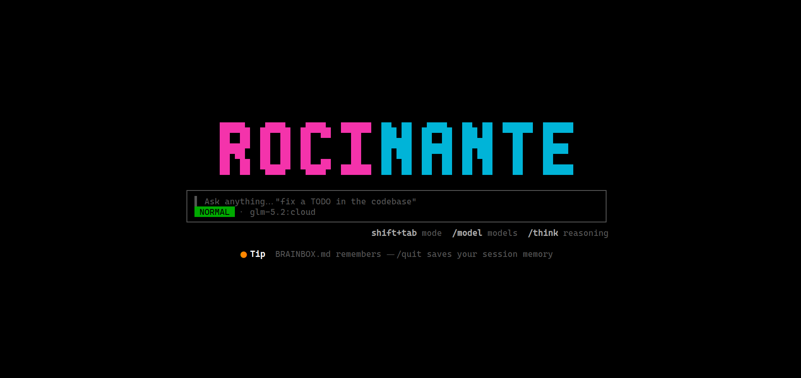
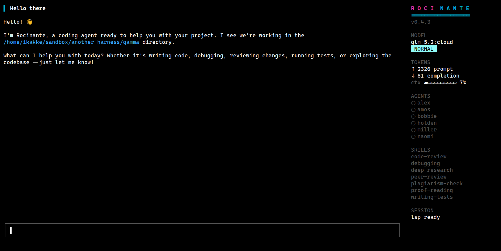

# Rocinante

An ironman suit for local models. Rocinante is a terminal coding agent that
runs an Ollama model (picked on first launch, remembered thereafter) as its
main brain and lets it **delegate subtasks to other models** — local or cloud — through
configurable subagent profiles. Claude Code-style operation (tools, skills,
permission modes, sessions), Opencode-style terminal experience, written in
Rust.

> *Rocinante: Don Quixote's horse — an ordinary steed carrying outsized
> ambitions, which is exactly the point.*

## Screenshots

The landing screen — a two-tone wordmark over one prominent input box:



The chat view, with the live right sidebar (model, mode, tokens, agents,
skills, session):



## Features

- **Agent loop** with core tools: `read`, `write`, `edit`, `bash`, `grep`,
  `glob` (ripgrep engine built in, `.gitignore`-aware)
- **Delegation**: a `task` tool exposing subagent profiles from your config —
  the main agent decides when to hand work to a scout model, a cloud
  heavyweight, or any other configured specialist. A startup model inventory
  (sizes, parameter counts, local vs cloud cost) is briefed into the prompt
  so it delegates each subtask to the cheapest adequate model — or pin every
  subagent to one model with `/submodel`
- **Effort tiers**: `/effort low|medium|high` (default high) maps to each
  provider's reasoning knob — Anthropic thinking budgets, OpenAI
  `reasoning_effort`, Ollama think levels
- **Providers**: Ollama (native API: `num_ctx`, `keep_alive`, structured
  outputs), plus OpenAI-compatible, Anthropic, and Gemini for subagents or as
  the main model
- **Modes**: `normal` (ask before edits/commands), `auto` (hands-off — only
  deny rules block), `plan` (read-only deep analysis that asks clarifying
  questions before presenting a plan) — with allow/deny rules like
  `Bash(cargo test:*)`
- **Tool-call repair**: local models drift; malformed calls are scraped from
  prose, schema-validated, bounced back with errors, and as a last resort
  forced through Ollama's constrained decoding
- **Sessions**: append-only JSONL transcripts, `-c/--continue` to resume,
  and continuous context hygiene — old tool outputs collapse to one-line
  stubs, background summarization kicks in at 60% of budget (no mid-turn
  stalls), and structured summaries keep paths/commands/errors verbatim.
  Standing context stays lean too: the skills index is a short trigger line
  per skill and BRAINBOX injects only its head (read in full on demand).
  `/context` opens a live grid of what fills the window, by category;
  `/clear` resets the conversation (`/clear --all` also wipes BRAINBOX.md)
- **Skills**: 40 built-ins plus SKILL.md-compatible discovery of your Claude
  Code skills (`~/.claude/skills`, `~/.claude/plugins`, project
  `.claude/skills`) with zero config; the `skill-maker` built-in can create
  new skills or install them from git, usable in the same session
- **Web research**: models browse the internet through the `bash` tool —
  search, fetch, extract, verify, and cite — and `miller` (the researcher)
  does it inside deep-research fan-outs
- **Data science & ML, not just code**: EDA, statistical modeling, SQL/
  DuckDB analytics, data wrangling, medallion lakehouses (bronze → silver
  star schemas → DuckLake), a full supervised-ML workflow (preprocessing →
  modeling/tuning → evaluation/calibration/SHAP), NLP (spaCy/NLTK),
  recommender systems, Quarto reports, and office/PDF deliverables (docx,
  xlsx, pptx, pdf) ship as built-in skills, with
  `avasarala` (data scientist) and `camina` (ML engineer) on the crew to
  run them
- **Self-configuring**: `/config add alias kimiko for kimi-k2.7-code:cloud
  with num_ctx 256000` — the agent edits `~/.rocinante/config.toml` for you
  (model aliases, providers, permissions, MCP/LSP servers), and new aliases
  appear in `/model` immediately, no restart
- **VRAM-aware**: cross-model local subagent calls are serialized so two big
  models don't evict each other

## Install

Linux and macOS:

```sh
curl -fsSL https://raw.githubusercontent.com/djynnius/rocinante/main/install.sh | sh
```

Windows (PowerShell):

```powershell
powershell -c "irm https://raw.githubusercontent.com/djynnius/rocinante/main/install.ps1 | iex"
```

Both verify SHA-256 checksums against the GitHub release before installing,
never need sudo, and support `ROCINANTE_VERSION=v0.3.0` to pin a version and
`ROCINANTE_INSTALL_DIR` to choose the destination. Once installed, `/update`
inside rocinante checks the latest release and replaces the binary in place
(same checksum verification; brew/scoop installs are pointed at their
package manager instead). Only ever runs when you invoke it.

Package managers:

```sh
brew install djynnius/tap/rocinante                # macOS and Linux
scoop install https://raw.githubusercontent.com/djynnius/rocinante/main/scoop/rocinante.json
```

From source: `cargo build --release` (Rust 1.96+). See
`docs/INSTALL_HOSTING.md` for the release pipeline and custom-domain setup.

## Quick start

```sh
# Prereq: Ollama running with a tool-capable model (or a cloud API key)
rocinante ask "hello"     # one-shot smoke test
rocinante                 # interactive agent in the current project
rocinante -c              # resume where you left off
```

## MCP servers

Rocinante is an MCP client (spec 2025-11-25, via the official `rmcp` SDK).
Configured servers' tools appear to the agent as `mcp__<server>__<tool>`,
behind the same permission system as everything else — allow specific ones
with rules like `allow = ["mcp__github__search_repositories"]`. Subagent
profiles can list MCP tool names too.

```toml
[mcp.github]                      # stdio: spawn a child process
command = "npx"
args = ["-y", "@modelcontextprotocol/server-github"]
env_from = { GITHUB_PERSONAL_ACCESS_TOKEN = "GITHUB_TOKEN" }  # child var ← host env var
include = ["search_repositories", "get_issue"]                # optional tool filter

[mcp.docs]                        # streamable HTTP
url = "https://example.com/mcp"
```

A server that fails to start is skipped with a warning; a hung call times
out at 60s. Keep total tool count modest (a warning fires above 25) — every
schema costs context and calling accuracy on a local main model.

## Language servers (LSP)

Rocinante speaks LSP. Servers spawn lazily per project (built-in defaults:
rust-analyzer, typescript-language-server, basedpyright/pyright, gopls —
whichever is on your PATH and matches the project), and **every edit gets
automatic diagnostics**: type errors and warnings from the language server
appear inline in the edit result within ~3 seconds, so the agent sees its
mistakes without running a build. An `lsp` tool adds
definition/references/hover/symbols lookups. Override or add servers:

```toml
[lsp.rust]
command = "rust-analyzer"
filetypes = ["rs"]
root_markers = ["Cargo.toml"]
# disabled = true    # opt out of a builtin
```

## Reviewing and committing

Edits and file writes show a **colored unified diff** in the permission
prompt before you approve them (y/allow, a/always, n/deny) — in both the
REPL and the TUI modal. `/commit` has the agent review `git status`/`git
diff`, stage exactly the related files, and write an atomic imperative
commit message.

## Extended thinking

`/think on` enables reasoning mode — Ollama's `think` flag for local
thinking models, Anthropic's thinking budget for Claude — streamed dim in
the transcript and never stored in context or sessions. In the TUI the
grey reasoning is **transient**: it shows while the model thinks, then
disappears the moment the answer begins, so it never clutters the
scrollback. `/think off` disables; `[defaults] think = true` in config
makes it the default.

## Parallel execution

When the model issues several tool calls in one message, read-only calls and
subagent delegations run **concurrently**; edits and commands stay
sequential in call order, and results always land in the transcript in the
original order. Write-capable subagents serialize among themselves;
read-only scouts fan out truly in parallel.

## Recurring prompts: /loop

`/loop 5m check git status and summarize new changes` re-submits that prompt
every 5 minutes while the session is open (never mid-turn; fires after the
current turn finishes if due). `/loop` shows status, `/loop stop` disarms.
One loop at a time. For unattended loops, pair with `--mode auto` plus
permission allow-rules so it doesn't sit waiting on an ask.

## Project memory: PILOT.md and BRAINBOX.md

Both live in `.rocinante/` and are injected into every session:

- **`PILOT.md`** — project instructions (Rocinante's CLAUDE.md). Run `/init`
  and the agent explores the project and writes it: what the project is,
  build/test commands, architecture map, conventions. Edit it by hand any
  time; it's loaded at startup — and if the README or a build manifest is
  newer than PILOT.md, a startup notice suggests re-running `/init`.
- **`BRAINBOX.md`** — living session memory: goals, state, decisions,
  gotchas, next steps. Refreshed **in the background** every 5 turns
  (configurable, never blocks a turn) and once more when you quit — skipped
  entirely when the background refresh already covers the session, so quit
  is usually instant.

```toml
[brainbox]
enabled = true            # default
update_every_turns = 5
model = "scout"           # optional: use a cheaper model for updates
```

## Switching models

Any model can be the main agent — local or cloud:

```sh
rocinante --model glm-5.2:cloud                      # bare Ollama tag
rocinante --model ollama                          # auto-pick from your Ollama server
rocinante --model anthropic/claude-opus-4-8       # cloud, zero config needed*
rocinante --model oracle                          # an alias from [models]
```

\* Cloud providers activate automatically when their key is in the
environment — `ANTHROPIC_API_KEY`, `GEMINI_API_KEY`, or `OPENAI_API_KEY` —
no config file required.

Mid-session, `/model` opens a **picker overlay** listing everything
switchable (config aliases plus every tag your Ollama server reports,
including signed-in `:cloud` models) — arrow keys to move, Enter to switch
with **conversation context preserved**, Esc to close. The current model is
preselected and tagged. `/model <number|name|provider/model>` still
switches directly without the picker. When an alias points at an Ollama tag,
only the alias is listed (the raw tag is hidden, so the list isn't
duplicated); you can still type the raw tag directly to switch to it.

## Configuration

Layered: built-in defaults → `~/.rocinante/config.toml` →
`<project>/.rocinante/config.toml` → `ROCINANTE_*` env vars. API keys are
**never** stored in config — only env-var names. You don't have to hand-edit
any of it: `/config <what you want>` has the agent write the user-wide file
for you, and bare `/config` summarizes what's currently set.

A project-local config is **untrusted by default**: its security-relevant
keys (`providers`, `mcp`, `lsp`, `agents`, `permissions.allow`,
`skills.extra_dirs`, `defaults.mode`) are ignored so a cloned repo can't
spawn processes, redirect providers, or auto-approve tool calls at startup.
Run `/trust` to opt a project in (see the [guide](docs/GUIDE.md)); your
user-wide config is always trusted.

```toml
[defaults]
model = "main"          # alias into [models]
mode = "normal"         # normal | auto | plan
num_ctx = 32768         # context window budget (VRAM is the real ceiling)
keep_alive = "10m"

[providers.ollama]
type = "ollama"
base_url = "http://localhost:11434"

[providers.anthropic]
type = "anthropic"
api_key_env = "ANTHROPIC_API_KEY"

[providers.openrouter]
type = "openai"                       # any OpenAI-compatible endpoint
base_url = "https://openrouter.ai/api/v1"
api_key_env = "OPENROUTER_API_KEY"

[models]
main   = { provider = "ollama", model = "glm-5.2:cloud" }
scout  = { provider = "ollama", model = "qwen3:8b", num_ctx = 16384 }
oracle = { provider = "anthropic", model = "claude-sonnet-4-5" }

# Subagent profiles the main agent can delegate to via the `task` tool
[agents.explorer]
description = "Fast read-only codebase exploration and summarization."
model = "scout"
tools = ["read", "grep", "glob"]
max_turns = 15

[agents.oracle]
description = "Escalation target for hard reasoning and design questions."
model = "oracle"
tools = ["read", "grep", "glob"]
max_turns = 10

[permissions]
allow = ["Bash(cargo check:*)", "Bash(cargo test:*)", "Bash(git status)"]
deny  = ["Bash(rm -rf:*)", "Read(**/*.pem)", "Read(./.env)"]

[skills]
# ~/.claude/skills, ~/.claude/plugins, and <project>/.claude/skills are
# scanned automatically; extra_dirs points at any other folder of skills
extra_dirs = ["~/team-skills"]
```

## Workspace layout

| Crate | Role |
|---|---|
| `rocinante-core` | Agent loop, tools, permissions, sessions, context, skills — a pure library over event channels |
| `rocinante-providers` | `Provider` trait + Ollama/OpenAI/Anthropic/Gemini implementations |
| `rocinante-tui` | ratatui terminal UI |
| `rocinante-cli` | The `rocinante` binary (TUI by default, `--no-tui` for the plain REPL) |

The core emits `AgentEvent`s on a broadcast channel and receives replies on an
mpsc — every frontend (REPL, TUI, and an eventual HTTP server) is a thin
client over that pair.

## Documentation

- [User guide](docs/GUIDE.md) — every command, full configuration reference, troubleshooting
- [Changelog](CHANGELOG.md)
- [Contributing](CONTRIBUTING.md) — build, architecture, conventions
- [Install hosting](docs/INSTALL_HOSTING.md) — release pipeline and custom-domain setup

## A note on the name (homage & disclaimer)

Rocinante was started by people who are huge fans of *The Expanse*, and the
project wears that on its sleeve: the ship's name and the crew — `holden`,
`naomi`, `amos`, `alex`, `bobbie`, `miller`, `avasarala`, and `camina` — are
an affectionate homage to the books by James S.A. Corey and the show they
inspired.

Rocinante is an independent, non-commercial open-source project. It is **not
affiliated with, endorsed by, or associated with** *The Expanse*, its authors,
its publishers, or any rights holders. All referenced names and marks belong
to their respective owners; they are used here as a tribute, not a claim.

## License

MIT — see [LICENSE](LICENSE).
